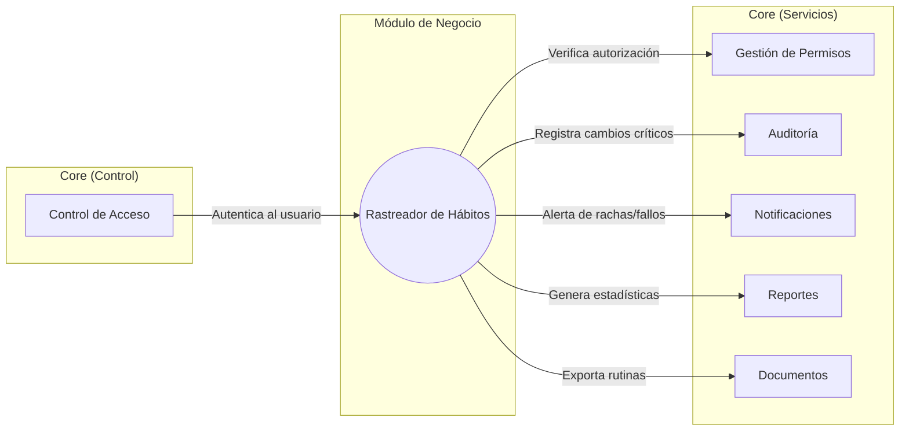

# Rastreador de habitos con metas

Proyecto de Programacion III en C#/.NET 10. La Practica 1 se ejecuta desde `RastreadorHabitos.Api`, una API HTTP independiente de la plantilla WinForms inicial. Los usuarios, sesiones y correos se guardan en JSON fuera del proceso. La estructura de estados del modulo de negocio esta en [docs/maquina-de-estados.md](docs/maquina-de-estados.md).

## Requisitos para ejecutar

- Windows, PowerShell 7 y SDK de .NET 10.
- Un servidor SMTP con STARTTLS, usuario y contrasena. Para un correo personal puede requerirse una contrasena de aplicacion.
- Un correo real al que se tenga acceso para abrir el enlace de activacion y recibir los codigos.

No se necesita SQL Server ni instalar paquetes NuGet adicionales. El archivo de datos se crea al iniciar en `data/rastreador.json` y `data/` esta excluido de Git. Los valores de las variables son privados; no deben guardarse en archivos versionados.

## Variables de entorno

| Variable | Uso |
| --- | --- |
| `RASTREADOR_DATA_DIR` | Directorio compartido por la API y el comando de envio; por defecto `data/` relativo al directorio de trabajo. |
| `RASTREADOR_BASE_URL` | URL incluida en el enlace de activacion; por defecto `http://localhost:5075`. |
| `RASTREADOR_ADMIN_EMAIL` | Correo del Administrador inicial; se utiliza solo si aun no existe un Administrador. |
| `RASTREADOR_ADMIN_PASSWORD` | Contrasena del Administrador inicial; minimo ocho caracteres con letras y numeros. |
| `RASTREADOR_SMTP_HOST` | Servidor SMTP. |
| `RASTREADOR_SMTP_PORT` | Puerto SMTP con STARTTLS, indicado por el proveedor. |
| `RASTREADOR_SMTP_FROM` | Correo remitente autorizado por el servidor SMTP. |
| `RASTREADOR_SMTP_USER` | Usuario SMTP. |
| `RASTREADOR_SMTP_PASSWORD` | Contrasena SMTP o contrasena de aplicacion. |

Desde la raiz del repositorio, en la **primera terminal**:

```powershell
$env:RASTREADOR_DATA_DIR = Join-Path (Get-Location) 'data'
$env:RASTREADOR_BASE_URL = 'http://localhost:5075'
$env:RASTREADOR_ADMIN_EMAIL = Read-Host 'Correo del administrador'
$env:RASTREADOR_ADMIN_PASSWORD = Read-Host 'Contrasena del administrador' -MaskInput
dotnet run --project .\RastreadorHabitos.Api\RastreadorHabitos.Api.csproj --no-launch-profile --urls http://localhost:5075
```

El Administrador inicial se crea una sola vez. Reiniciar la API no cambia su contrasena ni borra usuarios. La API responde en `http://localhost:5075/`. Si el enlace se abrira desde otro dispositivo, configure `RASTREADOR_BASE_URL` con una direccion accesible desde el.

En la **segunda terminal**, configure el mismo directorio y el servidor de correo. Los valores SMTP los proporciona su servidor:

```powershell
$env:RASTREADOR_DATA_DIR = Join-Path (Get-Location) 'data'
$env:RASTREADOR_SMTP_HOST = Read-Host 'Servidor SMTP'
$env:RASTREADOR_SMTP_PORT = Read-Host 'Puerto SMTP'
$env:RASTREADOR_SMTP_FROM = Read-Host 'Correo remitente'
$env:RASTREADOR_SMTP_USER = Read-Host 'Usuario SMTP'
$env:RASTREADOR_SMTP_PASSWORD = Read-Host 'Contrasena SMTP' -MaskInput
dotnet run --project .\RastreadorHabitos.Api\RastreadorHabitos.Api.csproj --no-launch-profile -- send-mail
```

Ejecute la ultima linea cada vez que quiera enviar los correos pendientes. La API no contacta SMTP durante el registro ni la recuperacion. Si el servidor no responde, los correos siguen pendientes; corrija la conexion y vuelva a ejecutar el comando. Tras un envio correcto, ejecutarlo otra vez no reenvia el mismo correo.

## Comandos de verificacion

Los ejemplos se ejecutan en una **tercera terminal** PowerShell 7, con el servidor en marcha. Use un correo propio distinto del Administrador:

```powershell
$base = 'http://localhost:5075'
$correo = Read-Host 'Correo real de prueba'
$clave = 'Clave12345'
function Enviar($ruta, $datos, $metodo = 'Post', $token = '') {
    $cabeceras = @{}
    if ($token) { $cabeceras.Authorization = "Bearer $token" }
    $opciones = @{ Uri = "$base$ruta"; Method = $metodo; Headers = $cabeceras; SkipHttpErrorCheck = $true }
    if ($metodo -ne 'Get') {
        $opciones.ContentType = 'application/json'
        $opciones.Body = $datos | ConvertTo-Json -Compress
    }
    Invoke-WebRequest @opciones
}
```

### Registro y activacion: RF-CA-01, 02, 14 a 17

```powershell
Enviar '/api/auth/register' @{nombre='Evaluador'; correo=$correo; contrasena=$clave}
Enviar '/api/auth/login' @{correo=$correo; contrasena=$clave}
Enviar '/api/auth/register' @{nombre='Duplicado'; correo=$correo; contrasena=$clave}
Enviar '/api/auth/register' @{nombre='Invalido'; correo='correo-invalido'; contrasena=$clave}
Enviar '/api/auth/register' @{nombre='Corta'; correo='otro-correo@example.com'; contrasena='Ab123'}
```

Se esperan respectivamente `201` con `activo:false`, `403` con cuenta inactiva, `409` por correo repetido y dos respuestas `400` controladas. Ejecute `send-mail` en la segunda terminal y abra el enlace recibido. El primer acceso devuelve `200`; abrirlo otra vez devuelve `400`. Antes de abrirlo puede solicitar otro enlace:

```powershell
Enviar '/api/auth/resend-activation' @{correo=$correo}
Enviar '/api/auth/resend-activation' @{correo='ausente@example.com'}
```

Las dos respuestas son iguales; el enlace anterior deja de servir. Para inspeccionar el hash con sal, registre dos usuarios con la misma clave y compare `HashContrasena` en `data/rastreador.json`: los valores son distintos y no contienen la clave. El archivo nunca debe subirse al repositorio.

### Sesion y bloqueo: RF-CA-03, 07, 18, 19

Despues de activar la cuenta:

```powershell
$login = (Enviar '/api/auth/login' @{correo=$correo; contrasena=$clave}).Content | ConvertFrom-Json
$token = $login.token
Enviar '/api/me/' @{} 'Get' $token
Enviar '/api/auth/login' @{correo='ausente@example.com'; contrasena='Incorrecta1'}
Enviar '/api/auth/login' @{correo=$correo; contrasena='Incorrecta1'}
Enviar '/api/me/logout' @{} 'Post' $token
Enviar '/api/me/' @{} 'Get' $token
```

La consulta autenticada devuelve el usuario y rol; ambos inicios fallidos devuelven el mismo mensaje `401`; tras cerrar sesion, la credencial devuelve `401`. Para comprobar el bloqueo, haga cinco peticiones con clave incorrecta y luego una con la correcta:

```powershell
1..5 | ForEach-Object { (Enviar '/api/auth/login' @{correo=$correo; contrasena='Incorrecta1'}).StatusCode }
(Enviar '/api/auth/login' @{correo=$correo; contrasena=$clave}).StatusCode
```

El sexto intento devuelve `429` durante 15 minutos. Use otra cuenta o espere ese tiempo para continuar.

### Roles y administracion: RF-CA-04 a 06, 08, 20, 21

Vuelva a iniciar sesion con un usuario Estándar y construya a mano una peticion de Administrador:

```powershell
$token = ((Enviar '/api/auth/login' @{correo=$correo; contrasena=$clave}).Content | ConvertFrom-Json).token
Enviar '/api/admin/users' @{} 'Get' $token
Enviar '/api/admin/users/00000000-0000-0000-0000-000000000001/role' @{rol='Administrador'} 'Put' $token
```

Ambas devuelven `403`, incluso si se intenta cambiar el propio rol. Los grupos protegidos y sus roles se leen en `RastreadorHabitos.Api/Program.cs`, mediante `RequireRol`. En esta tercera terminal indique de nuevo los datos del Administrador, pues las variables de la primera terminal no se comparten:

```powershell
$correoAdmin = Read-Host 'Correo del administrador'
$claveAdmin = Read-Host 'Contrasena del administrador' -MaskInput
$admin = ((Enviar '/api/auth/login' @{correo=$correoAdmin; contrasena=$claveAdmin}).Content | ConvertFrom-Json).token
$usuarios = (Enviar '/api/admin/users' @{} 'Get' $admin).Content | ConvertFrom-Json
$usuarios
$id = ($usuarios | Where-Object correo -eq $correo).id
Enviar "/api/admin/users/$id/role" @{rol='Administrador'} 'Put' $admin
Enviar "/api/admin/users/$id/deactivate" @{} 'Put' $admin
Enviar '/api/me/' @{} 'Get' $token
Enviar "/api/admin/users/$id/reactivate" @{} 'Put' $admin
$idAdmin = ($usuarios | Where-Object correo -eq $correoAdmin).id
Enviar "/api/admin/users/$idAdmin/deactivate" @{} 'Put' $admin
```

El listado nunca contiene hashes ni tokens; cambiar rol y desactivar requieren Administrador. La sesion del usuario desactivado devuelve `401`. El intento de autodesactivacion devuelve `400`.

### Recuperacion y cambio de contrasena: RF-CA-09 a 13, 22

```powershell
Enviar '/api/auth/request-reset' @{correo='ausente@example.com'}
Enviar '/api/auth/request-reset' @{correo=$correo}
```

Las respuestas son identicas. Ejecute `send-mail`, copie el codigo recibido y siga:

```powershell
$codigo = Read-Host 'Codigo recibido'
$anterior = ((Enviar '/api/auth/login' @{correo=$correo; contrasena=$clave}).Content | ConvertFrom-Json).token
Enviar '/api/auth/reset-password' @{correo=$correo; codigo=$codigo; contrasenaNueva='Nueva12345'}
Enviar '/api/auth/reset-password' @{correo=$correo; codigo=$codigo; contrasenaNueva='Otra12345'}
Enviar '/api/me/' @{} 'Get' $anterior
Enviar '/api/auth/login' @{correo=$correo; contrasena=$clave}
$nuevaSesion = ((Enviar '/api/auth/login' @{correo=$correo; contrasena='Nueva12345'}).Content | ConvertFrom-Json).token
Enviar '/api/me/change-password' @{contrasenaActual='Incorrecta1'; contrasenaNueva='Tercera123'} 'Post' $nuevaSesion
Enviar '/api/me/change-password' @{contrasenaActual='Nueva12345'; contrasenaNueva='Tercera123'} 'Post' $nuevaSesion
Enviar '/api/me/' @{} 'Get' $nuevaSesion
```

El codigo repetido devuelve `400`; la sesion anterior devuelve `401`; la contrasena vieja no permite iniciar sesion; una contrasena actual incorrecta devuelve `400`; el cambio correcto invalida la sesion. Para el restablecimiento forzado, use el token de Administrador y el identificador obtenido en el listado:

```powershell
Enviar "/api/admin/users/$id/force-reset" @{} 'Post' $admin
```

Ejecute `send-mail`, copie el nuevo codigo del correo y utilice `/api/auth/reset-password` con ese codigo. La contrasena anterior deja de servir inmediatamente.

### Cola y persistencia: RF-NOT-08, 09, 12, 13; RD-09 y RD-10

Detenga el acceso al servidor SMTP y registre otro usuario: el registro devuelve `201` y el correo queda con `Estado: Pendiente` en `data/rastreador.json`. Vuelva a habilitar SMTP y ejecute `send-mail` dos veces; el segundo comando indica `Enviados: 0`. Reinicie la API con el mismo `RASTREADOR_DATA_DIR`: los usuarios siguen presentes.

El envio real requiere credenciales SMTP. No se pueden verificar correos entregados sin un servidor configurado. Las pruebas locales de logica se ejecutan con:

```powershell
dotnet run --project .\RastreadorHabitos.Verificacion\RastreadorHabitos.Verificacion.csproj
```

## Maquina de estados y entrega

La entidad `Meta` tiene `EstadoMeta` con cuatro estados. Las transiciones permitidas, la prohibida explicita y los estados terminales se declaran en `RastreadorHabitos.Api/EstadoMeta.cs`; la tabla exigida esta en `docs/maquina-de-estados.md`. Las operaciones completas del rastreador se entregan despues.

La practica solicita cuatro pull requests como minimo, cada uno con "Que cambia", "Por que", "Como probarlo" y "Que NO incluye", y un tag `practica-1` sobre el punto integrado. El tag se envia con `git push origin --tags`; en Moodle se entrega la URL del repositorio y el nombre de la etiqueta. No coloque contrasenas ni `data/` en Git.

## Diagrama de componentes existente


