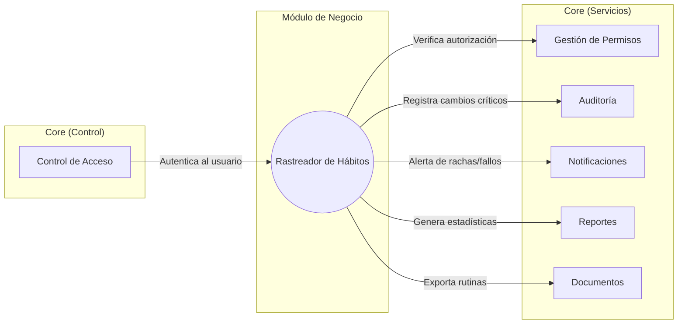

Contenido inicial del proyecto. Versión 0.1. Esto es un prototipo.

```mermaid
graph LR
    %% 1. Bloque Izquierdo (Entrada)
    subgraph Core_Entrada ["Core (Control)"]
        Acceso[Control de Acceso]
    end

    %% 2. Bloque Central (El tuyo)
    subgraph Negocio ["Módulo de Negocio"]
        Habitos((Rastreador de Hábitos))
    end

    %% 3. Bloque Derecho (Servicios)
    subgraph Core_Servicios ["Core (Servicios)"]
        Permisos[Gestión de Permisos]
        Auditoria[Auditoría]
        Notificaciones[Notificaciones]
        Reportes[Reportes]
        Documentos[Documentos]
    end

    %% Relaciones y flechas
    Acceso --> |Autentica al usuario| Habitos
    
    Habitos --> |Verifica autorización| Permisos
    Habitos --> |Registra cambios críticos| Auditoria
    Habitos --> |Alerta de rachas/fallos| Notificaciones
    Habitos --> |Genera estadísticas| Reportes
    Habitos --> |Exporta rutinas| Documentos
```
